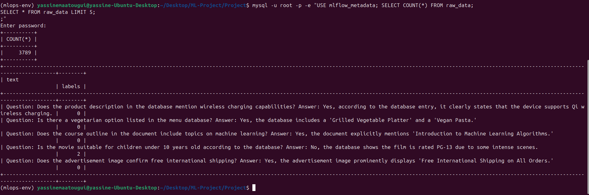
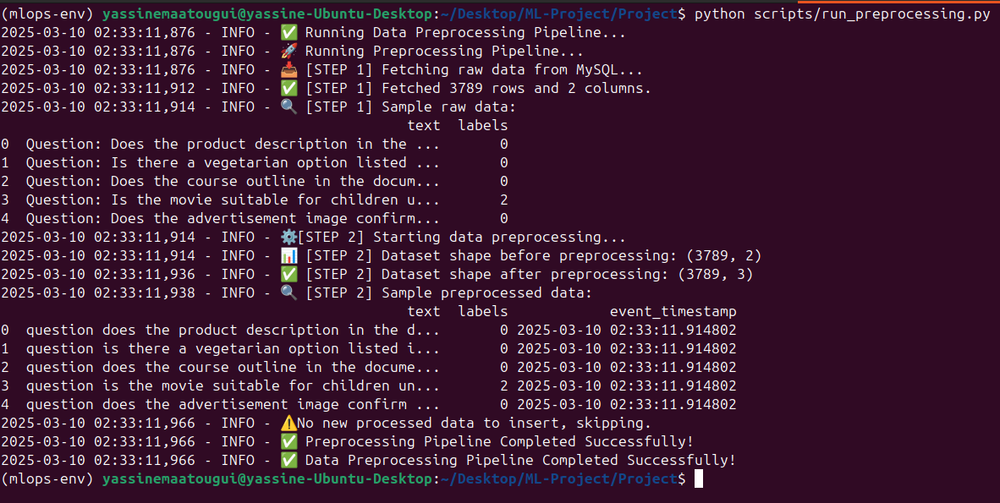
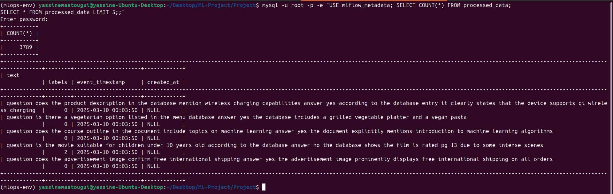
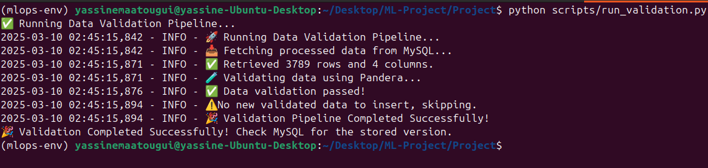
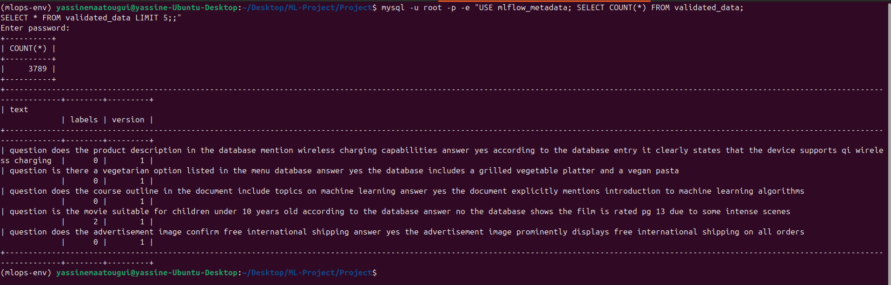
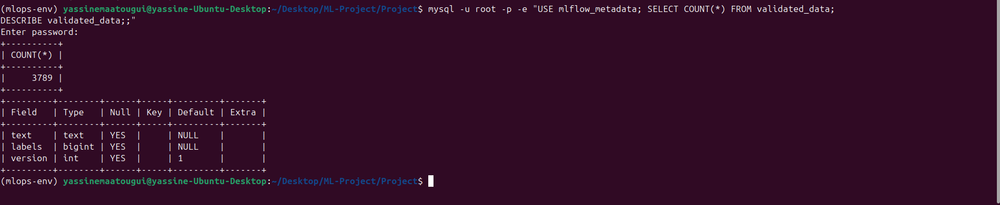
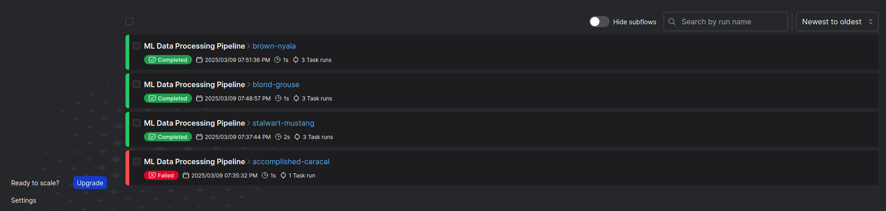
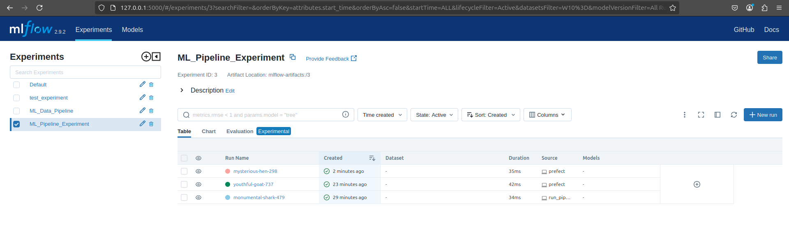

# Smart Inventory Search

## Milestone 1 (Project Inception)

### **Business Case**

Businesses managing large inventories often struggle with inefficient product retrieval systems. Traditional search mechanisms rely on exact keyword matching, which fails to handle descriptive or contextual queries effectively. This leads to:

- **Increased operational costs**: Employees spend excessive time manually filtering search results.
- **Lost sales opportunities**: Customers cannot find relevant products due to vague or inconsistent product descriptions.
- **Poor user experience**: Frustration from inefficient search systems reduces customer satisfaction and engagement.

A **Smart Inventory Search** system powered by machine learning (ML) can address these challenges by understanding natural language queries and contextual meaning, enabling faster and more accurate product discovery.

---

### **Business Value**

Implementing an ML-driven search system provides the following business value:

1. **Enhanced Search Accuracy**:
   - Understands user intent and context, improving product discovery.
   - Reduces reliance on rigid keyword matches.

2. **Increased Operational Efficiency**:
   - Reduces manual search time, allowing employees to focus on higher-value tasks.
   - Handles large and evolving product catalogs with minimal reconfiguration.

3. **Improved User Experience**:
   - Enables conversational and intuitive searching, increasing customer satisfaction.
   - Boosts engagement and sales by ensuring customers find relevant products quickly.

4. **Scalability & Adaptability**:
   - Adapts to new products and changing inventory without requiring extensive rule updates.
   - Scales seamlessly with business growth.

By leveraging ML, businesses can achieve faster, more accurate product retrieval, leading to increased efficiency and revenue growth.

---

### **ML Framing**

#### **Project Archetype: Software 2.0**

This project falls under the **Software 2.0** archetype, where traditional rule-based systems are replaced by machine learning models that learn from data. Unlike static, predefined SQL queries, this system uses deep learning models to dynamically interpret and process inventory search requests. Key advantages include:

- **Natural Language Understanding**: Handles ambiguous or complex user queries.
- **Contextual Reasoning**: Understands synonyms, product attributes, and natural language variations.
- **Continuous Improvement**: Learns from user interactions to improve over time.

#### **Feasibility & Baseline Model**

To establish feasibility, I am using a pre-trained NLP model as a baseline and fine-tune it on domain-specific inventory queries. The combination of **DistilBERT** and **Gemini API** ensures an optimal balance between accuracy, speed, and contextual understanding.

| Model Name         | Developer     | Purpose                                | Performance      |
|--------------------|---------------|----------------------------------------|------------------|
| DistilBERT         | Hugging Face  | NLP-based search query processing      | 97% of BERT      |
| Gemini API         | Google AI     | Advanced contextual NLP                | State-of-the-art |

#### **Baseline Model Justification**

- **DistilBERT**: A distilled version of BERT, offering fast inference while maintaining strong semantic search capabilities. It is pretrained on large-scale datasets and can be fine-tuned efficiently for inventory-specific queries.
- **Gemini API**: A cutting-edge NLP model known for handling conversational AI tasks and contextual search. It complements DistilBERT by processing ambiguous or complex user queries.

By fine-tuning DistilBERT on structured inventory datasets and leveraging Gemini API for contextual interpretation, the system can handle diverse search queries with high accuracy.

---

### **Baseline Model Card**

#### **Model Name**: `distilbert-base-uncased`

- **Developed by**: Hugging Face
- **Model Type**: Transformer-based Language Model
- **Language**: English
- **License**: Apache 2.0
- **Intended Use**: Fine-tuned for sequence classification and semantic search tasks.
- **Training Data**: Pretrained on BookCorpus and English Wikipedia.
- **Evaluation Results**: Retains 97% of BERT's performance while being 60% faster and 40% smaller.

#### **Limitations**
- Lacks `token_type_ids`, making it unsuitable for tasks requiring segment differentiation.
- Limited to English language understanding.

---

### **Metrics for Business Goal Evaluation**

To evaluate the success of the Smart Inventory Search system, I will use the following metrics:

1. **Search Accuracy**:
   - Precision, recall, and F1 score for product retrieval.
2. **User Satisfaction**:
   - Measured through user feedback or surveys.
3. **Operational Efficiency**:
   - Reduction in average search time (e.g., from 10 minutes to 2 minutes).

---

### **Dataset**

The dataset used for this project is the **Rakuten France Multimodal Product Classification Dataset**, available on Kaggle. It contains product data with images and text descriptions, making it ideal for training and evaluating multimodal search systems.

- **Dataset Name**: Rakuten France Multimodal Product Classification
- **Source**: [Kaggle](https://www.kaggle.com/datasets/moussasacko/rakuten-france-multimodal-product-classification)
- **Download Command**:
  ```bash
  kaggle datasets download moussasacko/rakuten-france-multimodal-product-classification

---

### **Proof of Concept (PoC)**

The PoC will be built using **Streamlit**, allowing users to input search queries and view relevant product results in real-time. The PoC will be deployed on **Hugging Face Spaces** for easy access and sharing.

#### **Steps to Set Up the PoC**

1. Clone the repository: (Make sure to install lfs using this command 'git lfs install')
   ```bash
   git clone https://huggingface.co/spaces/yassinemtg/smart-inventory-search
   ```
   If you want to clone without large files - just their pointers
   ```bash
   GIT_LFS_SKIP_SMUDGE=1 git clone https://huggingface.co/spaces/yassinemtg/smart-inventory-search
   ```

---

# Milestone 3 (Data Acquisition Validation and Preparation)

## **Introduction**
In this milestone, we focus on **data acquisition, validation, and preparation** to ensure high-quality data is available for model training.  
The process involves:
1. **Data Ingestion** – Storing raw data in MySQL.
2. **Data Preprocessing** – Cleaning and transforming data.
3. **Data Validation** – Ensuring consistency and quality.
4. **Feature Engineering & Storage** – Preparing features for model training.

Each step is crucial for building a **robust and reliable ML pipeline**, ensuring that only high-quality data is passed to the model.

---

### **Step 1: Data Ingestion**

Businesses rely on structured and accessible data storage to power machine learning pipelines. The first step in our **Smart Inventory Search** pipeline is **data ingestion**, ensuring that raw data is securely stored in **MySQL** for further processing.

---

### **Tasks Completed in This Step**

- ✅ **Database Connection Setup**  
  - Established a connection to the **MySQL database** using `SQLAlchemy`.
  - Defined a function to retrieve a database engine for seamless interactions.

- ✅ **Loading Raw Data**  
  - Read the dataset from a CSV file (`dataset-all.csv`).
  - Ensured the data is formatted correctly before ingestion.

- ✅ **Storing Raw Data into MySQL**  
  - Inserted the dataset into a table named **`raw_data`**.
  - Handled potential duplicate entries to maintain data integrity.

- ✅ **Confirming Data Storage**  
  - Queried MySQL to verify that the dataset was successfully inserted.
  - Ensured the row count matched expectations.

---

### **Code Implementation**

#### **1️⃣ Database Connection (`db_connection.py`)**

```python
from sqlalchemy import create_engine

# Database connection details
DB_NAME = "mlflow_metadata"
DB_USER = "root"
DB_PASS = "8520"
DB_HOST = "localhost"
DB_PORT = "3306"

def get_db_engine():
    """Create and return a database engine."""
    return create_engine(f"mysql+pymysql://{DB_USER}:{DB_PASS}@{DB_HOST}:{DB_PORT}/{DB_NAME}")
```

#### **2️⃣ Storing Raw Data (store_data.py)**

```python
import pandas as pd
from sqlalchemy import create_engine
import logging

# Initialize database connection
from database.db_connection import get_db_engine

def store_raw_data(file_path: str, table_name: str = "raw_data"):
    """Store raw dataset into MySQL."""
    engine = get_db_engine()
    df = pd.read_csv(file_path)
    
    # Insert into MySQL
    with engine.connect() as conn:
        df.to_sql(table_name, con=conn, if_exists="replace", index=False)

if __name__ == "__main__":
    store_raw_data("./datasets/dataset-all.csv")
```

#### **3️⃣ Verifying Data in MySQL**



---

### **Step 2: Data Preprocessing**

Once raw data is ingested into MySQL, it must be **cleaned and transformed** to prepare it for machine learning.  
This step ensures that data is **consistent, formatted correctly, and enriched with additional features**.

---

### **Tasks Completed in This Step**

- ✅ **Retrieving Raw Data from MySQL**  
  - Established a connection to MySQL.
  - Loaded the raw dataset into a Pandas DataFrame.

- ✅ **Cleaning and Transforming Data**  
  - Converted text to lowercase for uniformity.
  - Removed special characters using **regular expressions**.
  - Added an **event timestamp** to track data updates.

- ✅ **Storing Processed Data**  
  - Saved the cleaned dataset into **MySQL** (`processed_data` table).
  - Stored a backup copy as a **Parquet file** for further processing.

---

### **Code Implementation**

#### **1️⃣ Data Preprocessing (`preprocessing_pipeline.py`)**

```python
import pandas as pd
import re
import logging
from datetime import datetime
from database.db_connection import get_db_engine

def preprocess_data(df: pd.DataFrame) -> pd.DataFrame:
    """Preprocess text and transform features"""
    if df.empty:
        return df
    df["event_timestamp"] = pd.to_datetime(datetime.utcnow())
    df["text"] = df["text"].str.lower()
    df["text"] = df["text"].apply(lambda x: re.sub(r"\W+", " ", x))
    return df
```

####**2️⃣ Running Preprocessing Pipeline (run_preprocessing.py)**

📷 *Screenshots:*  



---

####**3️⃣ Verifying Processed Data in MySQL**




### **Step 3: Data Validation**

Before using the processed data for machine learning, we must ensure that it meets **quality and consistency** standards.  
This step **validates** the preprocessed dataset by applying various **data integrity checks**.

---

### **Tasks Completed in This Step**

- ✅ **Loading Processed Data**  
  - Retrieved the cleaned dataset from **MySQL**.
  - Loaded it into a Pandas DataFrame for validation.

- ✅ **Applying Data Validation Checks**  
  - Ensured that required columns exist.
  - Checked for missing values or inconsistencies.
  - Verified that the **event timestamp** column contains valid timestamps.

- ✅ **Storing Validated Data**  
  - Assigned a **validation version number** to track changes.
  - Stored validated data in MySQL (`validated_data` table).
  - Logged validation results in **MLflow** for tracking.

---

### **Code Implementation**

#### **1️⃣ Data Validation (`validation_pipeline.py`)**

```python
import pandas as pd
import logging
from database.db_connection import get_db_engine

def validate_data(df: pd.DataFrame) -> pd.DataFrame:
    """Validate processed data for consistency and quality"""
    if df.empty:
        return df
    required_columns = {"text", "labels", "event_timestamp"}
    if not required_columns.issubset(df.columns):
        missing = required_columns - set(df.columns)
        return pd.DataFrame()  # Return empty DataFrame if validation fails

    # Check for missing values
    if df.isnull().sum().any():
        df = df.dropna()  # Remove rows with missing values

    # Ensure event_timestamp is a valid datetime
    df["event_timestamp"] = pd.to_datetime(df["event_timestamp"], errors="coerce")
    df = df.dropna(subset=["event_timestamp"])
    return df
```

####**2️⃣ Running Validation Pipeline**

📷 *Screenshots:*  





---

### **Step 4: Data Versioning**

To ensure **traceability, reproducibility, and rollback capabilities**, we implement **data versioning**.  
This allows us to track changes in the dataset across different preprocessing and validation iterations.

---

### **Tasks Completed in This Step**

- ✅ **Versioning Preprocessed Data**  
  - Each **processed dataset** is assigned a unique version ID based on its **timestamp**.
  - Preprocessed data is stored in **MySQL** with versioning enabled.

- ✅ **Versioning Validated Data**  
  - Each **validated dataset** is assigned a version identifier.
  - The system automatically stores validated data into a separate MySQL table with version control.

- ✅ **Tracking Versions in MLflow**  
  - Integrated **MLflow** to log dataset versions.
  - Ensured that every stage of the pipeline records its **version history** in MLflow.

---

### **Code Implementation**

#### **1️⃣ Storing Preprocessed Data with Versioning (`store_processed_data.py`)**

```python
import pandas as pd
from sqlalchemy import create_engine
from datetime import datetime
from database.db_connection import get_db_engine

def store_processed_data(df: pd.DataFrame, table_name="processed_data"):
    """Store processed data into MySQL with versioning."""
    engine = get_db_engine()

    # Generate a version timestamp
    version = datetime.utcnow().strftime("%Y%m%d%H%M%S")
    df["version"] = version  # Append version to dataset

    # Store the data
    df.to_sql(table_name, con=engine, if_exists="append", index=False)

    return version  # Return the assigned version
```

#### **2️⃣ Logging Dataset Versions in MLflow (ml_pipeline.py)**

```python
import mlflow

def log_dataset_version(step_name, version):
    """Log dataset version to MLflow."""
    with mlflow.start_run(nested=True, run_name=step_name):
        mlflow.log_param("dataset_version", version)
```

📷 *Screenshots:*  



---

### **Step 5: Feature Store**

Once the data is validated, it must be **materialized** into the feature store to make it available for real-time and batch machine learning applications.  
This step ensures that the **Smart Inventory Search** system has **efficient access to the latest features**.

---

### **Tasks Completed in This Step**

- ✅ **Feature Store Configuration**  
  - Defined **Feast** feature views to structure the dataset.
  - Configured a **MySQL online store** for real-time feature serving.

- ✅ **Registering Features**  
  - Ran `feast apply` to deploy the feature store schema.

- ✅ **Materializing Features**  
  - Pulled the latest validated data into the feature store.
  - Ensured that event timestamps align with the feature views.

- ✅ **Querying Stored Features**  
  - Validated feature materialization by fetching feature values.

---

### **Code Implementation**

#### **1️⃣ Feature Store Definition (`feature_repo/feature_repo/features.py`)**

```python
from feast import Entity, FeatureView, Field, ValueType
from feast.types import Int32, Float32 
from feast.data_format import ParquetFormat
from feast.infra.offline_stores.file_source import FileSource

customer = Entity(
    name="customer_id",
    value_type=ValueType.INT32, 
    description="Customer identifier",
)

customer_source = FileSource(
    path="../data/processed_data.parquet",
    file_format=ParquetFormat(),
    timestamp_field="event_timestamp",
    created_timestamp_column="created_at",
)

customer_feature_view = FeatureView(
    name="customer_feature_view",
    entities=[customer],
    schema=[ 
        Field(name="age", dtype=Int32), 
        Field(name="income", dtype=Float32), 
    ],
    online=True,
    source=customer_source,
)
```

---

- Running:

```bash
feast apply
```

📷 *Screenshots:*  


---

### **Step 6: ML Pipeline Setup**

To **automate data ingestion, preprocessing, validation, and feature materialization**,  
we implement a fully orchestrated ML pipeline using **Prefect** and **MLflow**.  

This ensures a **seamless, reproducible, and scalable** workflow for data processing and model training.

---

### **Tools Used in the ML Pipeline**

- 🏗 **Prefect** → Orchestrates the entire pipeline flow.
- 📊 **MLflow** → Tracks experiment runs, logs parameters, and monitors dataset versions.
- 🛢 **MySQL** → Stores both raw and processed data.
- 🔍 **Feast** → Handles **feature materialization** into an online feature store.

---

### **Pipeline Workflow Overview**

1️⃣ **Data Ingestion** → Load raw data into **MySQL**.  
2️⃣ **Data Preprocessing** → Clean and transform data for feature extraction.  
3️⃣ **Data Validation** → Ensure data integrity before usage.  
4️⃣ **Data Versioning** → Track dataset versions in **MLflow**.  
5️⃣ **Feature Materialization** → Store features in **Feast** for online access.  

---

### **Code Implementation**

#### **1️⃣ ML Pipeline Orchestration (`ml_pipeline.py`)**
```python
import mlflow
import mlflow.sklearn
from prefect import flow, task
from scripts.store_data import store_raw_data
from scripts.run_preprocessing import run_preprocessing_pipeline
from scripts.run_validation import validation_pipeline
from feast import FeatureStore

mlflow.set_tracking_uri("http://127.0.0.1:5000")
mlflow.set_experiment("ML_Pipeline_Experiment")

with mlflow.start_run():
    mlflow.log_param("run_name", "full_pipeline_execution")

@task
def ingest_data():
    """Task to ingest raw data into MySQL and track it in MLflow."""
    with mlflow.start_run(nested=True, run_name="Data_Ingestion"):
        mlflow.log_param("step", "ingestion")
        store_raw_data(file_path="./datasets/dataset-all.csv")
        mlflow.log_metric("ingested_rows", 3789)  # Update dynamically if needed
        mlflow.log_artifact("./datasets/dataset-all.csv")

@task
def preprocess_data():
    """Task to preprocess raw data and store processed data in MySQL with MLflow tracking."""
    with mlflow.start_run(nested=True, run_name="Data_Preprocessing"):
        mlflow.log_param("step", "preprocessing")
        processed_rows = run_preprocessing_pipeline()
        mlflow.log_metric("processed_rows", processed_rows)

@task
def validate_data():
    """Task to validate the preprocessed data and store validated versions with MLflow tracking."""
    with mlflow.start_run(nested=True, run_name="Data_Validation"):
        mlflow.log_param("step", "validation")
        validation_version, validated_rows = validation_pipeline()
        mlflow.log_metric("validation_version", validation_version)
        mlflow.log_metric("validated_rows", validated_rows)

@task
def materialize_features():
    """Task to materialize features using Feast."""
    store = FeatureStore(repo_path="feature_store/feature_repo")
    store.materialize_incremental(end_date=datetime.utcnow())

@flow(name="ML Data Processing Pipeline")
def ml_pipeline():
    """Prefect flow to run the full ML data pipeline with MLflow tracking."""
    with mlflow.start_run(run_name="ML_Pipeline"):
        ingest_data()
        preprocess_data()
        validate_data()
        materialize_features()

if __name__ == "__main__":
    ml_pipeline()
```

---

Running pipeline:

```bash
python scripts/run_pipeline.py
```

---

- output ==>


- Prefect Pipeline UI:


- MLflow experiment logs:



